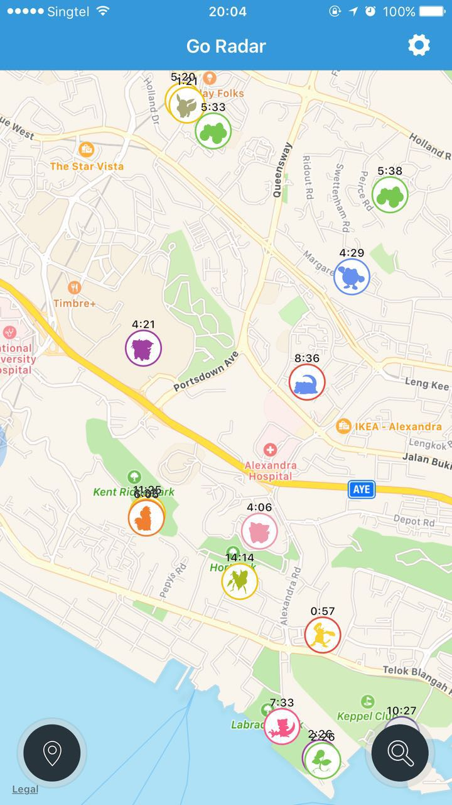

##Pokemon 地图


	7、8月份pokemon go这款手游大热，但是接下来的2个月这款游戏的热度急剧下降，用户大量流失，其中一个原因就是游戏内置的Sighting系统十分不好用，因此出现了很多第三方的pokemon分布地图。


###实现自己的一个pokemon地图

####要求
1. 给定一个经纬度坐标和一个pokemon的信息，在地图上相应位置显示出来
2. 每一个显示的pokemon都有一个显示时间限制，按秒计，显示了相应时间后消失

####例子

```
{
	latitude: 1.2538139,
    longitude: 103.8158383,
    id: 1,
    liveTime: 900
}
```
有一个如上数据的pokemon，表示的是当前pokemon的id是1，显示在(1.2538139, 103.8158383)这个位置，显示时间为900s(15min)，15min之后这个pokemon消失。

关于上文中的id，相关解释如下：
在pokemon游戏中，有一个pokemon列表，共有151个pokemon，每个pokemon有一个唯一的id，比如id为1的是妙蛙种子。显示的时候，对相应的id显示对应的pokemon的图片。

####效果
用一个其他第三方地图截图说明实现的效果



####说明
1. 实现目标是实现一个web版的效果，因此需要借助于第三方地图工具。
2. 目前地图库有很多，优先选择google地图，但由于google国内被封锁的情况，也可以使用其他的地图api，比如百度地图
3. 地图怎么用，查阅相关的官方文档